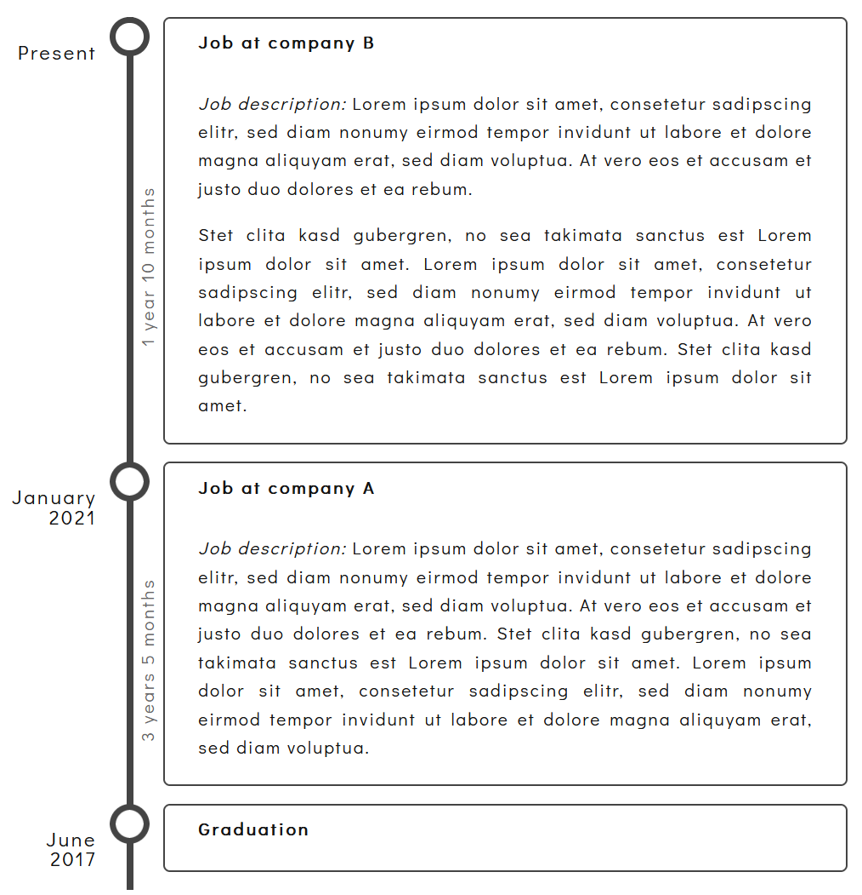

# hugo-shortcode-timeline

This is a theme component for hugo. 

This component contains a shortcode to include a timeline in your .md files.

The individual items can be collapsed or expanded.



## Demo

You can see this shortcode-gallery in action on [my website](https://matze.rocks/it/).

## Installation

Clone this git repository into your *themes* folder. 

```
git clone https://github.com/mfg92/hugo-shortcode-timeline.git
```

Next edit your projects 
*config.toml* and add this theme component to your themes:

```
theme = ["your-main-theme", "hugo-shortcode-timeline"]
```

To read about hugo's theme components and how to use them have a look at 
https://gohugo.io/hugo-modules/theme-components/.


## Usage Example

Here is an usage example:

```html


    {}
_Job description:_ Lorem ipsum dolor sit amet, consetetur sadipscing elitr, sed diam nonumy eirmod tempor invidunt ut labore et dolore magna aliquyam erat, sed diam voluptua. At vero eos et accusam et justo duo dolores et ea rebum.

Stet clita kasd gubergren, no sea takimata sanctus est Lorem ipsum dolor sit amet. Lorem ipsum dolor sit amet, consetetur sadipscing elitr, sed diam nonumy eirmod tempor invidunt ut labore et dolore magna aliquyam erat, sed diam voluptua. At vero eos et accusam et justo duo dolores et ea rebum. Stet clita kasd gubergren, no sea takimata sanctus est Lorem ipsum dolor sit amet.
    {}

    {}
_Job description:_ Lorem ipsum dolor sit amet, consetetur sadipscing elitr, sed diam nonumy eirmod tempor invidunt ut labore et dolore magna aliquyam erat, sed diam voluptua. At vero eos et accusam et justo duo dolores et ea rebum. Stet clita kasd gubergren, no sea takimata sanctus est Lorem ipsum dolor sit amet. Lorem ipsum dolor sit amet, consetetur sadipscing elitr, sed diam nonumy eirmod tempor invidunt ut labore et dolore magna aliquyam erat, sed diam voluptua.
    {}

    {}
Successfully finished my xyz degree ...
Grades:
- Subject A: 1.3
- Subject B: 2.3
- Subject C: 2.0
- ...
    {}


```

## Acknowledgement

Inspired by this [article](https://metalblueberry.github.io/post/howto/2021-02-28_hugo_timeline_shortcode/).
